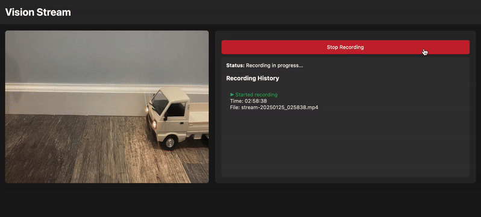
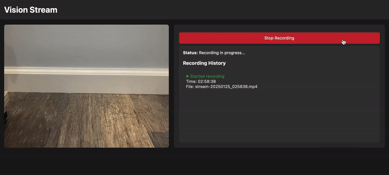

# vision-stream

`vision-stream` is an extensible web-based video streaming and recording interface that can integrate with different computer vision models to visualize their predictions in real time. It provides a minimalistic interface for viewing live video feeds, visualizing model predictions, and recording sessions for playback.

## Features
- Real-time streaming and visualization of computer vision model predictions.
- Flexible integration with custom models and visualization overlays.
- Video recording and playback interface to capture and share the true model inference performance on different systems.
- Built-in support for the [Ultralytics](https://github.com/ultralytics) [YOLO-World](https://docs.ultralytics.com/models/yolo-world/) pretrained object detection model, capable of recognizied hundreds of common objects and concepts.

### View Live Predictions

The web interface displays real-time video feeds with model predictions overlaid. For example, `yolov8s-worldv2` localizes objects in each frame of a video stream scene with bounding boxes. The bounding box plot could further be extended to include class names, confidence scores, etc.

   
  
   

### Record and Playback Video

Users can record sessions while maintaining the actual processing frame rate, preserving the true speed of model inference and ensuring accurate playback of the results.

   
  
   

Instead of relying on nominal camera FPS, the recordings measure and use the actual frame rate experienced after model inference, ensuring recordings accurately reflect the true performance of your system. This means your recorded videos will play back at exactly the speed they were processed, providing an authentic representation of model latency and performance.
